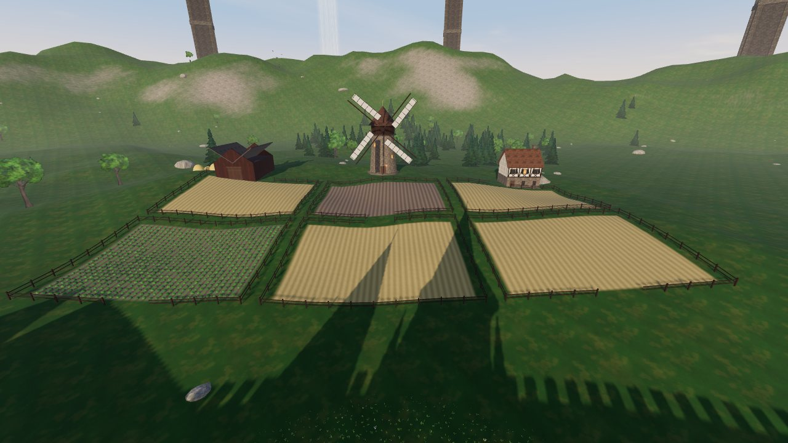
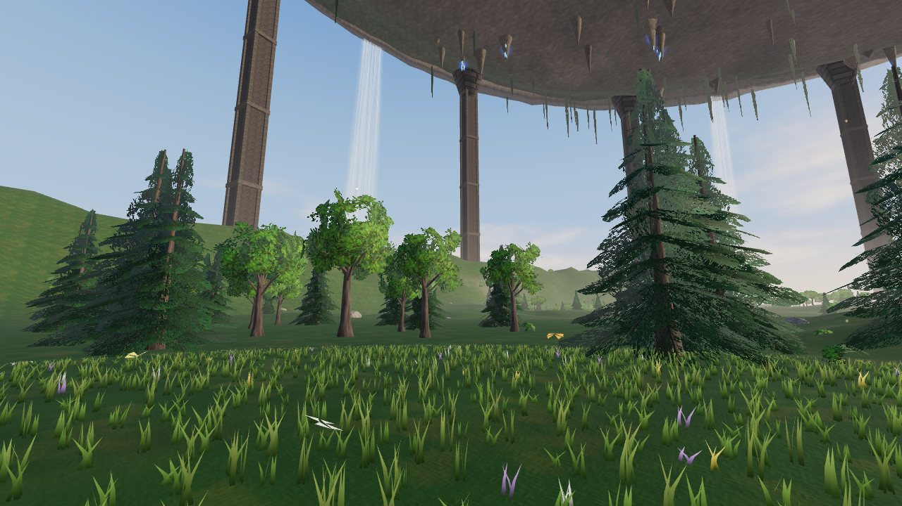

# LINK START — 부유성 VR

**Meta Quest 브라우저에서 바로 플레이하는 VRMMORPG 스타일 WebXR 게임.**
Sword Art Online에서 영감을 받은 비공식 팬 제작 게임입니다. 텍스처, 모델, 사운드, 음악 등 모든 에셋을 코드로 생성하기 때문에 외부 에셋 파일이 하나도 없습니다.


| 시장 거리와 남문 | 부유성 제1층 전경 |
| --- | --- |
|  |  |
| **성벽 밖 농장과 풍차** | **숲** |
|  |  |

## 플레이 방법 (Meta Quest)

1. Quest 브라우저에서 **https://joyong133.github.io/Joyong133/** 을 엽니다.
2. 로딩이 끝나면 **VR로 접속**을 누릅니다. **Link Start!**
3. PC 브라우저에서도 **PC로 접속**을 눌러 키보드와 마우스로 플레이할 수 있습니다.

> 처음 한 번은 GitHub Pages를 켜야 합니다. 저장소 **Settings → Pages → Build and deployment → Source**를 **GitHub Actions**로 바꾼 뒤, **Actions** 탭에서 `Deploy to GitHub Pages` 워크플로를 다시 실행(Re-run)하면 위 주소로 배포됩니다.

## 게임 내용

- **Link Start 연출**: 무지개빛 터널, 감각 체크, 그리고 "Welcome to…"
- **시작의 마을**: 5겹의 중세 목조·석조 주택 약 200채, 대성당(장미창, 스테인드글라스), 성벽과 망루, 시장 거리, 분수 광장, 우물. 굴뚝에서 연기가 오르고, 담쟁이가 벽을 타고, 가로등 아래 바닥이 따뜻하게 빛납니다
- **마을 사람들**: 튜닉, 바지, 머리색이 제각각인 주민들이 팔다리를 흔들며 골목을 걸어 다닙니다
- **부유성**: 머리 위로 윗층의 암반 천장(지층 무늬, 이끼, 늘어진 덩굴, 푸른 결정), 윗층 가장자리에서 허공으로 쏟아지는 폭포, 층을 떠받치는 거대한 외곽 기둥, 천장까지 닿는 미궁 탑, 세계의 끝 전망대 아래로 펼쳐진 구름 바다
- **필드**: 잎이 하나하나 그려진 활엽수와 침엽수 숲(바람에 흔들리고 햇빛이 잎을 투과), 구릉 초원과 꽃, 거울 호수, 전초기지와 모닥불. 하늘엔 새 떼가 돌고 풀밭엔 나비가 날아다닙니다
- **농장**: 성벽 밖의 울타리 친 밀밭(바람이 지나가면 물결치는 밀), 양배추 밭, 갈아엎은 밭, 날개가 도는 풍차, 농가와 헛간, 건초 더미, 허수아비
- **제2층 "탁상 고원"**: 미궁 탑의 층 보스를 쓰러뜨리면 열립니다. 메사 지형, 분화구 마을 메사리아, 새 몬스터와 퀘스트, 낚시 등 미니게임
- **전투**: 컨트롤러를 실제로 휘두르는 속도로 대미지가 결정됩니다. 몬스터가 달려드는 순간 검을 대면 **패링**
- **소드 스킬**: 트리거를 길게 눌러 검에 빛이 모이면 크게 휘둘러 발동합니다. 휘두르는 방향에 따라 **버티컬 / 호리즌탈 / 슬랜트**
- **몬스터**: 와일드 보어, 그레이 울프, 필드 보스 **보어 킹**. 쓰러뜨리면 폴리곤 파편으로 흩어집니다
- **퀘스트**: 기사 엘렌의 3단계 퀘스트. 마지막 보상은 새 검 **청은의 장검**
- **RPG 요소**: 레벨, HP, EXP, Col, 회복 포션(상인 모라), 안전지대 회복, 사망 시 광장에서 부활
- **SAO 스타일 UI**: 좌상단 HP 바, 원형 버튼 메뉴(상태 · 아이템 · 퀘스트 · 설정 · 로그아웃), 대미지 숫자, 몬스터 커서
- **전이문**: 광장의 전이문에 들어가면 초원 전초기지로 순간이동하고, 반대로도 이동할 수 있습니다
- **사운드**: 효과음 전부와 BGM(마을, 필드, 보스)을 절차적으로 합성하고, 3D 공간 음향으로 재생합니다
- 진행 상황은 기기에 자동 저장됩니다

## 조작법

| | Quest VR | PC |
| --- | --- | --- |
| 이동 | 왼쪽 스틱 (스틱 클릭: 달리기) | WASD, Shift 달리기, Space 점프 |
| 회전 | 오른쪽 스틱 (스냅 30° / 부드럽게) | 마우스 |
| 공격 | 오른손 검을 실제로 휘두르기 | 좌클릭 |
| 소드 스킬 | 오른쪽 트리거를 길게 눌러 충전한 뒤 휘두르기 | 우클릭 길게 눌러 충전한 뒤 좌클릭 |
| 대화 | A | E |
| 메뉴 | B / Y | Tab |
| 포션 | X | Q |

설정 메뉴에서 회전 방식, 이동 비네트(멀미 방지), 음악, **검 각도**, **검을 쥘 손(왼손잡이 지원)**, 이동 방향 기준을 바꿀 수 있습니다.

타이틀 화면에서 그래픽 품질(낮음 · 보통 · 높음)을 고를 수 있습니다. Quest 2는 **보통**, Quest 3는 **높음**을 권장합니다.

## 개발

```bash
npm install
npm run dev      # http://localhost:5173
npm run build    # dist/ 에 정적 빌드
```

- Three.js (WebGL + WebXR), Vite
- 개발 서버에서 `?iwer`를 붙이면 Meta의 [IWER](https://github.com/meta-quest/immersive-web-emulation-runtime)로 Quest 3와 컨트롤러를 에뮬레이션합니다. 헤드셋 없이 VR 경로를 테스트할 때 씁니다. (프로덕션 빌드에는 포함되지 않습니다)
- WebXR은 HTTPS에서만 동작하므로, 헤드셋에서 테스트하려면 GitHub Pages 같은 HTTPS 호스팅을 사용하세요.

```
src/
  core/    절차적 텍스처, 지오메트리 병합, 대기 안개, 재질
  world/   지형, 하늘(큐브맵 베이크), 마을, 부유성 구조물, 식생, 물, 전이문, 충돌
  game/    게임 루프, 플레이어, 입력, 검, 몬스터, NPC, 퀘스트, UI, 인트로, 오디오, 이펙트
```

### 성능 메모 (Quest)

- 정적 지오메트리를 재질별로 병합해 마을 전체를 수십 개의 draw call로 그립니다
- 나무, 몬스터, NPC는 인스턴싱으로 그립니다. 가까운 나무는 잎 카드(alpha-to-coverage) 메시로, 먼 나무는 시작할 때 미리 렌더링한 임포스터 빌보드 한 번의 draw call로 그립니다
- 밀밭과 풀은 플레이어 주변에만 GPU로 생성되고, 새, 나비, 연기, 꽃가루 같은 생동감 요소는 그래픽 품질에 따라 줄어듭니다
- 그림자 맵은 시작할 때 한 번만 굽고, 하늘은 큐브맵으로 한 번만 렌더링해 환경광으로도 씁니다
- 풀은 플레이어를 따라다니는 GPU 인스턴싱 필드로, 높이맵 텍스처에서 지형 높이를 읽습니다

---

비공식 팬 프로젝트이며 원작 권리자와 관련이 없습니다.

---

# 日本語 VR — 기초에서 N1까지

**Meta Quest 브라우저에서 하는 일본어 학습 앱. 히라가나부터 JLPT N1까지 매일 할 일을 정해 주고, 차례대로 따라가면 N1까지 가도록 짜여 있습니다.**

- 주소: **https://joyong133.github.io/Joyong133/nihongo/** (위 LINK START 타이틀 화면 아래 링크로도 들어갈 수 있습니다)
- Quest 브라우저에서 열고 **VR로 시작**을 누르면 벚꽃 정원 한가운데에 학습 패널이 뜹니다. PC나 휴대폰 브라우저에서는 **브라우저로 시작**을 누르면 마우스·터치·키보드로 할 수 있습니다.

## 들어 있는 것

| 영역 | 분량 |
| --- | --- |
| 가나 | 히라가나·가타카나 전부(탁음·요음·외래어 표기 포함), 한국어 발음 비교, 헷갈리는 글자 팁 |
| 한자 | 2,136자(상용한자 전체). N5 80 · N4 167 · N3 371 · N2 369 · N1 1,149. 한국어 훈음, 음독·훈독, 획수 |
| 단어 | 8,034개. N5 718 · N4 668 · N3 2,140 · N2 1,809 · N1 2,699. 모든 단어에 한국어 뜻, 빈도순 학습 |
| 문법 | 450개 패턴. N5 65 · N4 80 · N3 105 · N2 106 · N1 94. 한국어 설명, 접속 형태, 예문 930개(번역 포함) |
| 독해 | 40지문(레벨별 8개). 한국어 번역, 해설, 소리 내어 읽기 |
| 청해 | 40개 대화(레벨별 8개). 남·여 음성, 스크립트, 한 줄씩 다시 듣기, 섀도잉 |
| 연습 | 동사 활용 14종, 형용사 활용, 숫자 읽기, 조수사·날짜·시간 |
| 모의고사 | 레벨마다 JLPT 형식(문자·어휘 / 문법 / 독해 / 청해). 실제 합격 기준(총점과 과목별 기준점)으로 판정 |

## 떠먹여 주는 구조

1. **오늘의 학습** 버튼 하나만 누르면 됩니다: 복습 → 새 항목 배우기 → 바로 확인 문제 → 독해·청해 → 결과 요약.
2. 틀린 문제는 같은 세션 안에서 다시 나오고, 배운 항목은 **간격 반복(SRS)** 으로 4시간 → 1일 → 1주 → 1달 → 6달 간격으로 다시 나옵니다.
3. 레벨의 항목을 다 배우면 **모의고사**가 열리고, 합격하면 다음 레벨로 넘어갑니다. 레벨이 오를 때마다 정원의 계절이 바뀝니다(봄 → 여름 → 가을 → 겨울 → 밤 → 황금).
4. 하루 분량은 설정에서 **가볍게(하루 8단어) · 보통(15) · 집중(25)** 중에서 고르고, 로드맵에서 N1까지 남은 예상 일수를 볼 수 있습니다.
5. 이미 아는 레벨이 있으면 처음 설정이나 로드맵에서 그 레벨부터 시작할 수 있습니다.

## 조작

| | Quest VR | PC |
| --- | --- | --- |
| 선택 | 컨트롤러 레이를 겨누고 트리거 (핸드 트래킹이면 손가락 집기) | 클릭 · 숫자 키 1–4 |
| 다음 | A / X | Enter · Space |
| 뒤로 | B / Y | Esc |
| 넘기기 | 스틱 좌우 | 방향키 |
| 패널을 정면으로 | 스틱 누르기 또는 그립 | — |
| 다시 듣기 / 후리가나 | 화면의 버튼 | R / F |

## 음성

기기의 일본어 음성 합성(Web Speech API)으로 읽어 줍니다. 소리가 안 나오면 기기에 일본어 음성이 설치되어 있는지 확인하세요. `public/nihongo/audio/` 에 미리 만든 음성 파일(ogg)을 넣으면 그 파일을 먼저 씁니다. 파일 이름 규칙은 `nihongo/src/core/audio.js` 의 `audioKey` 를 보세요.

## 데이터 다시 만들기

```bash
python3 tools/nihongo/build_data.py   # 한자·단어 원본을 받아 한국어 뜻·문법·독해·청해와 합쳐 public/nihongo/data/*.json 생성
node tools/nihongo/chunk.mjs          # kuromoji로 예문을 문절 단위로 나눔(문장 조립 ★ 문제용)
python3 tools/nihongo/build_fonts.py  # 쓰인 글자만 모아 Noto Sans JP/KR 서브셋 폰트 생성
```

한국어 뜻과 문법·독해·청해는 `nihongo/content/` 아래 텍스트 파일에 있습니다.

## 출처와 라이선스

- 한자 정보: [kanji-data](https://github.com/davidluzgouveia/kanji-data) (KANJIDIC2 기반, CC BY-SA 4.0, © EDRDG)
- JLPT 단어 목록: [open-anki-jlpt-decks](https://github.com/jamsinclair/open-anki-jlpt-decks) (MIT)
- 폰트: Noto Sans JP / Noto Sans KR (SIL Open Font License 1.1)
- 형태소 분석(빌드할 때만): kuromoji.js (Apache 2.0)
- 한국어 뜻, 문법 설명, 예문, 독해·청해 지문은 이 프로젝트에서 직접 썼습니다.
- JLPT 급수 구분은 비공식입니다(2010년 이후 공식 목록이 없어 널리 쓰이는 목록을 따랐습니다).

---

# 동화나라 런너즈 — 동화 속 3D 달리기 레이스

**테일즈런너에서 영감을 받은 비공식 팬 게임. 동화 속 열 개의 세상을 8명의 캐릭터로 달리는 3D 장애물 레이스입니다.** 캐릭터와 맵은 이 프로젝트에서 새로 만들었고, 그래픽·음악·효과음은 모두 코드로 생성합니다.

- 주소: **https://joyong133.github.io/Joyong133/runner/**
- PC 브라우저(키보드)와 휴대폰·태블릿(터치)에서 모두 할 수 있습니다.

## 게임 모드

| 모드 | 내용 |
| --- | --- |
| 스피드전 | 봇 7명과 순수 달리기 대결. 1등이 들어오면 30초 안에 골인해야 합니다 |
| 아이템전 | 코스의 ? 상자에서 아이템을 얻어 씁니다. 뒤처질수록 좋은 아이템이 나와요 |
| 타임어택 | 혼자 달리며 맵별 최고 기록에 도전. 내 최고 기록 달리기가 반투명 **고스트**로 함께 달리고, 바퀴마다 고스트와의 차이를 알려 줘요 |

난이도(쉬움 · 보통 · 어려움)에 따라 봇의 실력과 속도가 달라집니다. 기록과 순위, 고스트는 기기에 저장됩니다.

레이스가 끝나면 **시상식**이 열려요. 1~3등은 금·은·동 단상에서 세리머니를 하고, 나머지 친구들은 뒤에서 박수를 쳐 줍니다.

## 캐릭터 (8명)

| 이름 | 소개 | 속도 | 가속 | 점프 | 힘 | 컨트롤 |
| --- | --- | :-: | :-: | :-: | :-: | :-: |
| 하랑 | 씩씩한 모험가 (밸런스형) | 3 | 3 | 3 | 3 | 3 |
| 보리 | 깡충 토끼 소녀 | 3 | 5 | 4 | 1 | 3 |
| 곰돌 | 든든한 곰 탐험대 | 3 | 2 | 2 | 5 | 3 |
| 루나 | 별빛 꼬마 마법사 | 5 | 2 | 3 | 2 | 2 |
| 나비 | 날쌘 고양이 소녀 | 2 | 4 | 5 | 1 | 5 |
| 볼트 | 태엽 로봇 | 4 | 2 | 1 | 4 | 3 |
| 피피 | 나무 인형 소년 | 3 | 3 | 3 | 2 | 5 |
| 아리 | 여우 꼬리 소녀 | 4 | 4 | 3 | 2 | 2 |

힘이 셀수록 장애물에 덜 날아가고, 컨트롤이 좋을수록 공중·빙판에서 잘 움직입니다.

## 맵 (10개)

모든 맵은 한 바퀴를 도는 순환 코스이고, 1~4번 맵은 **3바퀴**, 5~10번 맵은 **2바퀴**를 달립니다. 화면 오른쪽 위 미니맵에서 모두의 위치를 볼 수 있어요. 맵마다 음악과 주변 소리(새소리, 바람, 물방울, 용암 소리 등)가 다릅니다.

| # | 맵 | 모티프 | 특징 |
| --- | --- | --- | --- |
| 1 | 동화 초원 ★ | 첫 번째 이야기 | 회전 막대, 점프대, 버섯 범퍼, 징검다리 |
| 2 | 과자 숲 ★★ | 헨젤과 그레텔 | 통통 젤리 바닥, 굴러오는 케이크, 초콜릿 컨베이어, 문 고르기 |
| 3 | 이상한 나라 체스판 ★★★ | 앨리스 | 카드 병정 밀어내기, 찻잔 회전판, 무너지는 체스 타일, 다섯 개 중 진짜 문 |
| 4 | 콩나무 하늘길 ★★★ | 잭과 콩나무 | 구름 위 오르막, 떠다니는 구름 발판, 돌풍 |
| 5 | 인어의 바닷속 ★★★★ | 인어공주 | 낮은 중력, 해류, 오르내리는 조개 발판, 굴러오는 통 |
| 6 | 눈의 여왕 얼음성 ★★★★ | 눈의 여왕 | 미끄러운 빙판, 눈덩이, 얼음 타일, 난간 없는 길 |
| 7 | 오즈의 노란 벽돌길 ★★★★★ | 오즈의 마법사 | 회오리바람, 좁은 벽돌 다리, 쿵쿵 블록 |
| 8 | 자정의 시계탑 ★★★★★★ | 신데렐라 | 톱니 회전판, 시계추 망치, 컨베이어, 계단 |
| 9 | 사막의 램프 궁전 ★★★★★★ | 알라딘 | 모래 늪, 하늘을 나는 양탄자, 모래 폭풍 |
| 10 | 용의 화산 ★★★★★★★ | 용과 용사 | 떨어지는 불덩이, 무너지는 발판, 굴러오는 바위, 좁은 다리 |

## 조작법

| | PC | 터치 |
| --- | --- | --- |
| 달리기 | 방향키 / WASD | 왼쪽 조이스틱 |
| 점프 (공중에서 한 번 더 = 2단 점프) | Space / Ctrl | 점프 버튼 |
| 부스터 (게이지 절반 사용) | Shift | 부스터 버튼 |
| 아이템 | Z | 아이템 버튼 |
| 체크포인트로 돌아가기 | R | — |
| 일시정지 | Esc | 오른쪽 위 II |

- **스타트 대시**: 출발 신호 GO!에 맞춰 앞으로 키를 누르면 빠르게 출발합니다(너무 일찍 누르면 실패).
- **별**을 먹으면 부스터 게이지가 차고, 노란 화살표 **가속판**을 밟으면 빨라집니다.
- 코스 밖으로 떨어지면 마지막 **체크포인트**에서 다시 시작합니다.

## 개발 메모

```
runner/src/
  core/   입력(키보드·터치), 오디오(효과음 합성·맵별 음악·환경음), 후처리(블룸), 저장, 난수
  data/   캐릭터, 맵(코스 스크립트), 테마
  world/  코스 빌더(세그먼트 → 트랙·충돌체·AI 경로), 장애물, 충돌 처리, 배경·소품, 텍스처
  game/   레이스 진행, 러너 물리, 봇 AI, 아이템, 파티클, 캐릭터 모델, 시상식, 고스트
  ui/     로비, HUD
```

- 맵은 `runner/src/data/maps.js`에서 `b.straight(40)`, `b.curve(90, 20)`, `b.stones(6)`, `b.hammers(30, 2)` 같은 한 줄짜리 구간을 이어 붙여 만듭니다. 커브 각도의 합이 360°가 되게 하고, 직선 두 개에 `{ flex: 'a' }`, `{ flex: 'b' }`를 붙이면 코스가 출발선으로 정확히 돌아오도록 그 두 직선의 길이를 자동으로 맞춰 줍니다(`{ rise: 'close' }`는 높이를 맞춤). 마지막은 `b.close()`.
- 테스트용 주소: `runner/?race=3&mode=item` 로 바로 3번 맵 아이템전에 들어가고, `&auto`를 붙이면 내 캐릭터도 봇이 대신 달립니다.
